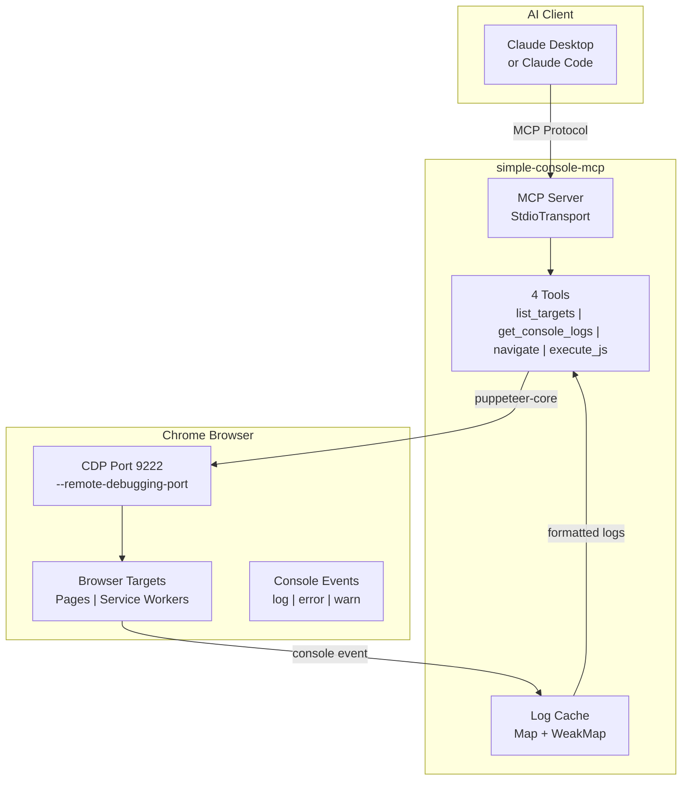

# simple-console-mcp

[](https://opensource.org/licenses/Apache-2.0)
[](https://www.npmjs.com/package/simple-console-mcp)
[](https://nodejs.org/)
[](https://modelcontextprotocol.io/)

[← Back to Muripo HQ](https://tznthou.github.io/muripo-hq/)

> Minimal Console MCP — The smallest unit for browser debugging

[中文版 (Chinese)](README_ZH.md)

---

## TL;DR

An extremely minimal MCP Server focused on browser Console Log monitoring. **97% lighter** than chrome-devtools-mcp (4 tools vs 50+), so your AI assistant won't consume a ton of context tokens while debugging.

| Comparison | chrome-devtools-mcp | simple-console-mcp |
|------------|---------------------|-------------------|
| Tools | 50+ | **4** |
| Context Cost | ~5000 tokens | **~200 tokens** |
| Focus | Full-featured | Console + JS execution |

---

## Why I Built This

This project started with a simple question: **"I just want to see Console Logs. Why do I need 50 tools?"**

chrome-devtools-mcp is powerful, but every time the AI calls a tool, it needs to understand all 50+ tools first. The tool descriptions alone consume a huge amount of context. For scenarios where you just want to quickly debug JavaScript errors, that's wasteful.

So I built this "**Minimum Viable MCP**":

- `list_targets` — List browser tabs
- `get_console_logs` — Read Console output
- `navigate` — Navigate or reload
- `execute_js` — Execute JavaScript in page context

Just four tools. Good enough.

The core goal of this MCP is to fully embrace the **subtraction principle** — achieve maximum effect with minimum functionality. It's also an application of the **80/20 rule**: if 80% of debugging scenarios only need Console Logs, why load 100% of the tools?

---

## Test Verification

All features have been tested with a comprehensive test suite:

### Test Scenarios

| Test | Description | Status |
|------|-------------|--------|
| **01-basic-logs** | console.log, warn, error, info, debug | ✅ Pass |
| **02-js-errors** | TypeError, ReferenceError, SyntaxError, RangeError | ✅ Pass |
| **03-async-errors** | Promise rejection, async/await, setTimeout, fetch errors | ✅ Pass |
| **04-stress-test** | 600 logs generated, verifies 500 limit works | ✅ Pass |
| **05-special-chars** | Emoji, Chinese, Japanese, JSON objects, Unicode | ✅ Pass |

### Feature Verification

| Feature | Status |
|---------|--------|
| `list_targets` - List browser tabs | ✅ |
| `get_console_logs` - Read console output | ✅ |
| `navigate` - Navigate or reload page | ✅ |
| `execute_js` - Execute JavaScript in page | ✅ |
| `filter` parameter - Filter log types | ✅ |
| Auto-launch Chrome with debug mode | ✅ |
| Isolated user-data-dir (`/tmp/chrome-cdp-9222`) | ✅ |
| 500 log cache limit | ✅ |
| 5s execution timeout for `execute_js` | ✅ |
| Clear error message for Chrome conflicts | ✅ |

### Sample Test Output

```
$ list_targets
Available targets:
[0] page: http://127.0.0.1:5500/test/01-basic-logs.html

$ get_console_logs
=== Console Logs for http://127.0.0.1:5500/test/01-basic-logs.html ===
[2025-12-17T15:21:28.054Z] LOG: [Test 01] Page loaded - Basic Logs Test
[2025-12-17T15:21:28.054Z] LOG: This is a LOG message
[2025-12-17T15:21:28.054Z] WARN: This is a WARNING message
[2025-12-17T15:21:28.054Z] ERROR: This is an ERROR message
[2025-12-17T15:21:28.054Z] INFO: This is an INFO message
[2025-12-17T15:21:28.054Z] DEBUG: This is a DEBUG message
(showing 6 of 6 total, filter: all)

$ execute_js --code="document.title"
=== JavaScript Executed ===
Code: document.title

Result:
"Test 01: Basic Console Logs"
```

---

## Installation

### Option 1: npm (Recommended)

**Claude Code (one-liner):**

```bash
claude mcp add simple-console -- npx -y simple-console-mcp
```

**Claude Desktop** or other MCP clients ([Cursor](https://docs.cursor.com/context/model-context-protocol) / [Windsurf](https://docs.windsurf.com/windsurf/mcp) / [Cline](https://docs.cline.bot/mcp-servers/configuring-mcp-servers)):

```json
{
  "mcpServers": {
    "simple-console": {
      "command": "npx",
      "args": ["-y", "simple-console-mcp"]
    }
  }
}
```

### Option 2: GitHub URL

**Claude Code:**

```bash
claude mcp add simple-console -- npx -y github:tznthou/simple-console-mcp
```

### Option 3: Local Installation

```bash
git clone https://github.com/tznthou/simple-console-mcp.git
cd simple-console-mcp && npm install
```

```bash
claude mcp add simple-console -- node /path/to/simple-console-mcp/src/index.js
```

---

## Starting Chrome CDP

### Auto-launch (v1.1.0+)

**No manual setup required!** The MCP automatically detects whether Chrome has CDP enabled:
- If CDP is already enabled → connects directly
- If not → **auto-launches** a new Chrome with debug mode using isolated profile

Just install the MCP, and tell Claude "help me debug" — it handles everything automatically.

> **Note (v1.4.0+)**: If you already have a regular Chrome open, the MCP will show a clear error message asking you to close it first. This prevents conflicts between regular and debug Chrome instances.

### Manual Start (Fallback)

If auto-launch fails, you can start Chrome manually:

```bash
# macOS
/Applications/Google\ Chrome.app/Contents/MacOS/Google\ Chrome --remote-debugging-port=9222

# Linux
google-chrome --remote-debugging-port=9222

# Windows
"C:\Program Files\Google\Chrome\Application\chrome.exe" --remote-debugging-port=9222
```

---

## Tools

### `list_targets`

List all available browser targets (pages, Service Workers, etc.).

| Parameter | Type | Default | Description |
|-----------|------|---------|-------------|
| `port` | number | 9222 | Chrome CDP port |

```
Available targets:
[0] page: http://localhost:3000
[1] service_worker: chrome-extension://xxx/background.js
[2] page: chrome-extension://xxx/popup.html
```

### `get_console_logs`

Get Console output from a specific target. Starts monitoring on first call.

| Parameter | Type | Default | Description |
|-----------|------|---------|-------------|
| `targetIndex` | number | 0 | Target index from list_targets |
| `maxLines` | number | 50 | Maximum lines to return |
| `filter` | string | "all" | Filter type: all / error / warn / log / info / debug |
| `port` | number | 9222 | Chrome CDP port |

```
=== Console Logs for http://localhost:3000 ===
[12:34:56] ERROR: Uncaught TypeError: Cannot read property 'x' of undefined
[12:34:57] WARN: Deprecation warning...
(showing 2 of 50 total logs, filter: all)
```

### `navigate`

Navigate to a URL or reload the page.

| Parameter | Type | Default | Description |
|-----------|------|---------|-------------|
| `url` | string | - | Target URL or "reload" |
| `targetIndex` | number | 0 | Target index |
| `port` | number | 9222 | Chrome CDP port |

```
Navigated to: http://localhost:3000/login
Page title: "Login"
(Console logs cleared)
```

### `execute_js` (New in v1.4.0)

Execute JavaScript code in the page context. Useful for clicking buttons, filling forms, reading DOM, or calling page functions.

| Parameter | Type | Default | Description |
|-----------|------|---------|-------------|
| `code` | string | - | JavaScript code to execute (max 10,000 chars) |
| `targetIndex` | number | 0 | Target index |
| `port` | number | 9222 | Chrome CDP port |

**Safety measures:**
- Code length limit: 10,000 characters
- Execution timeout: 5 seconds
- Result size limit: 50,000 characters

**Examples:**

```javascript
// Click a button
document.querySelector('button#submit').click()

// Read page title
document.title

// Call page function
myApp.doSomething()

// Fill form input
document.getElementById('email').value = 'test@example.com'

// Get element count
document.querySelectorAll('.item').length
```

```
=== JavaScript Executed ===
Code: document.title

Result:
"My Application"
```

---

## Architecture



---

## How It Works: Pull-based

```
Claude calls get_console_logs → MCP returns accumulated logs → Claude processes
         ↑                                                        |
         └──────────────── Claude must call again ────────────────┘
```

**Behavior**:
1. On first `get_console_logs` call, MCP starts monitoring that target
2. Console events are continuously collected in memory (max 500 entries)
3. **Claude does NOT receive automatic notifications** — must call `get_console_logs` again to see new logs

> **Why Pull-based?**
> MCP protocol is request-response based and doesn't support push notifications. The server cannot proactively tell Claude "there's a new error" — Claude must actively ask.

---

## Chrome Extension Development

This MCP supports monitoring Console output from Chrome Extensions:

```
[0] page: http://localhost:3000           ← Regular webpage
[1] service_worker: chrome-extension://abc/background.js  ← Extension background script
[2] page: chrome-extension://abc/popup.html               ← Extension popup
```

Use different `targetIndex` values to monitor each target separately.

---

## Tech Stack

| Technology | Purpose |
|------------|---------|
| Node.js 18+ | Runtime |
| ES Modules | Module system |
| @modelcontextprotocol/sdk | MCP protocol implementation |
| puppeteer-core | Chrome CDP connection (no bundled Chromium) |
| zod | Parameter validation |

---

## Project Structure

```
simple-console-mcp/
├── src/
│   └── index.js        # MCP Server main code (~550 lines, security hardened)
├── bin/
│   └── start-chrome.sh # Chrome startup script
├── package.json
├── README.md           # English docs (this file)
├── README_ZH.md        # Chinese docs
└── LICENSE             # Apache-2.0
```

---

## Requirements

| Item | Requirement |
|------|-------------|
| Node.js | 18+ |
| Chrome | Any version with `--remote-debugging-port` enabled |
| OS | macOS / Linux / Windows |

---

## Notes

1. **Chrome must have CDP enabled**: Chrome without `--remote-debugging-port` cannot be connected
2. **One Chrome at a time**: If multiple Chrome instances exist, MCP connects to the first one
3. **Log cache limit**: Each target keeps at most 500 logs, older ones are automatically removed
4. **Navigation clears logs**: Calling navigate clears the target's log cache

---

## Changelog

### v1.4.0 (2025-12-17)

**New Features:**
- ✨ **`execute_js` tool**: Execute JavaScript in page context
  - Click buttons, fill forms, read DOM, call page functions
  - Safety measures: 5s timeout, 10K code limit, 50K result limit
- ✨ **Simplified Chrome launch logic**:
  - Directly launches debug Chrome with isolated profile (`/tmp/chrome-cdp-9222`)
  - Clear error message when regular Chrome conflicts with debug Chrome

**Improvements:**
- 📦 Code grew from ~460 to ~550 lines (+20%)
- 🔧 Removed automatic Chrome kill logic (user must close regular Chrome manually)
- 📝 Better error messages explaining Chrome conflict resolution

### v1.3.6 (2025-12-17)

**Security Hardening** (comprehensive code review fixes):

| Issue | Severity | Fix |
|-------|----------|-----|
| URL Protocol Injection | 🔴 Critical | Added `validateUrl()` allowing only `http://` and `https://` |
| Shell Command Injection | 🔴 Critical | `start-chrome.sh` validates port must be integer 1024-65535 |
| Cleanup Race Condition | 🔴 Critical | Added `isCleaningUp` flag, `uncaughtException` handler |
| Private API Dependency | 🟠 High | `getTargetId()` prefers official API, falls back to `_targetId` |
| Incomplete Resource Cleanup | 🟠 High | Added `browser.isConnected()` check before disconnect |
| Missing HTTP Warning | 🟡 Medium | Non-localhost HTTP URLs now show security warning |
| Unlimited URL Length | 🟡 Medium | Added `MAX_URL_LENGTH = 2048` limit |

### v1.3.1 (2025-12-13)

- 🐛 Fixed `navigate` tool's `targetIndex` inconsistency with `list_targets`

### v1.3.0 (2025-12-13)

**Security Fixes:**

| Issue | Severity | Fix |
|-------|----------|-----|
| Command Injection | 🔴 Critical | Added `validatePort()` |
| Race Condition | 🔴 Critical | Used Promise lock |
| Resource Leak | 🔴 Critical | Added `SIGINT/SIGTERM` handlers |

### v1.2.0 (2025-12-12)

- 🔧 Auto-launched Chrome now uses isolated `user-data-dir`

### v1.1.0 (2025-12-12)

- ✨ Added auto-launch Chrome CDP feature

### v1.0.0 (2025-12-12)

- 🎉 Initial release

---

## License

[](https://opensource.org/licenses/Apache-2.0)

This project is licensed under the [Apache License 2.0](LICENSE).

---

## Author

- GitHub: [@tznthou](https://github.com/tznthou)
