# simple-console-mcp

[](https://opensource.org/licenses/Apache-2.0)
[](https://www.npmjs.com/package/simple-console-mcp)
[](https://nodejs.org/)
[](https://modelcontextprotocol.io/)

[← 回到 Muripo HQ](https://tznthou.github.io/muripo-hq/)

> 極簡 Console MCP — 瀏覽器除錯的最小單位

[English Version](README_EN.md)

---

## TL;DR

一個極度精簡的 MCP Server，只專注於瀏覽器 Console Log 監聽。比 chrome-devtools-mcp 輕 **97%**（3 個工具 vs 50+ 個），讓 AI 助手幫你 debug 時不會吃掉一堆 context token。

| 對比 | chrome-devtools-mcp | simple-console-mcp |
|------|---------------------|-------------------|
| 工具數 | 50+ | **3** |
| Context 消耗 | ~5000 tokens | **~160 tokens** |
| 功能 | 全功能 | Console 專精 |

---

## 開發心得

這個專案源自一個簡單的問題：**「我只想看 Console Log，為什麼要載入 50 個工具？」**

chrome-devtools-mcp 很強大，但每次 AI 呼叫工具前都要先理解這 50+ 個工具的用途，光是工具描述就吃掉大量 context。對於只想快速 debug JavaScript 錯誤的場景來說，這太浪費了。

所以我做了這個「**最小可行 MCP**」：

- `list_targets` — 列出瀏覽器分頁
- `get_console_logs` — 讀取 Console 輸出
- `navigate` — 導航或重新整理

就這三個。夠用就好。

這個 MCP 的核心目標，是徹底執行**減法原則**——用最小的功能達成最大的效果。實際上，這也是 **80/20 法則**的運用：80% 的 debug 場景只需要看 Console Log，那為什麼要載入 100% 的工具？

我想這應該是全世界最小、能夠對 Console Log 做監控的 MCP 了吧。對於這一點，我覺得蠻值得驕傲的。這也是我第一次開發 MCP 工具，過程中學會了怎麼把套件推送到 npm，讓全世界的人都能下載使用。不知道這個工具能不能被大家採用，但至少對我自己來說非常實用。

話說回來，這個 MCP 對於非 Vibe Coder 來說可能有點無聊——真正的工程師本來就會自己看 Console Log 找問題，哪需要 AI 幫忙？所以這東西更像是練練手、增加經驗值的小專案。不過，能把一個想法從零做到發布 npm，這個過程本身就很有價值了。

---

## 測試驗證

使用 [Cyber Reality Glitcher](https://github.com/tznthou/cyber-glitch)（Muripo Day 13）作為測試網頁，驗證所有功能正常運作：

```
$ list_targets
Available targets:
[0] page: http://localhost:3000/ (title: "loading...")

$ get_console_logs
=== Console Logs for http://localhost:3000/ ===
[00:02:50] WARN: cdn.tailwindcss.com should not be used in production...
[00:02:51] LOG: %c[CYBER_GLITCHER] Reality has been compromised.
[00:02:51] LOG: %cHover text to scramble | Click to zap | Shift+Click to lock
(showing 3 of 3 total logs, filter: all)

$ get_console_logs --filter=warn
[00:02:50] WARN: cdn.tailwindcss.com should not be used in production...
(showing 3 of 3 total logs, filter: warn)

$ navigate --url=http://localhost:3000/index.html
Navigated to: http://localhost:3000/index.html
Page title: "Cyber Reality Glitcher - Muripo Day 13"
(Console logs cleared)
```

| 功能 | 狀態 |
|------|------|
| `list_targets` | ✅ 成功列出瀏覽器分頁 |
| `get_console_logs` | ✅ 成功讀取 Console 輸出 |
| `navigate` | ✅ 成功導航頁面 |
| `filter` 參數 | ✅ 成功過濾 log 類型 |
| 自動啟動 Chrome | ✅ v1.2.0 修復獨立 profile 問題 |
| 安全性修復 | ✅ v1.3.0 修復命令注入、Race Condition 等 |
| Index 一致性 | ✅ v1.3.1 修復 navigate 與 list_targets index 不一致 |

---

## 系統架構

```mermaid
graph TB
    subgraph Client["AI 客戶端"]
        CLAUDE["Claude Desktop<br/>or Claude Code"]
    end

    subgraph MCP["simple-console-mcp"]
        SERVER["MCP Server<br/>StdioTransport"]
        TOOLS["3 Tools<br/>list_targets | get_console_logs | navigate"]
        CACHE["Log Cache<br/>Map + WeakMap"]
    end

    subgraph Browser["Chrome 瀏覽器"]
        CDP["CDP Port 9222<br/>--remote-debugging-port"]
        PAGES["Browser Targets<br/>Pages | Service Workers"]
        CONSOLE["Console Events<br/>log | error | warn"]
    end

    CLAUDE --> |"MCP Protocol"| SERVER
    SERVER --> TOOLS
    TOOLS --> |"puppeteer-core"| CDP
    CDP --> PAGES
    PAGES --> |"console event"| CACHE
    CACHE --> |"formatted logs"| TOOLS
```



---

## 使用流程

```mermaid
sequenceDiagram
    participant User as 使用者
    participant AI as Claude
    participant MCP as simple-console-mcp
    participant Chrome as Chrome CDP

    User->>Chrome: 啟動 Chrome --remote-debugging-port=9222
    User->>AI: 「我的網頁壞了」

    AI->>MCP: list_targets()
    MCP->>Chrome: 取得所有分頁
    Chrome-->>MCP: [0] localhost:3000, [1] google.com
    MCP-->>AI: 顯示分頁列表

    AI->>MCP: get_console_logs(targetIndex: 0)
    MCP->>Chrome: 監聽 Console 事件
    Chrome-->>MCP: [ERROR] TypeError at app.js:42
    MCP-->>AI: 格式化 Log 輸出

    AI-->>User: 「問題在 app.js 第 42 行...」

    opt 需要重新整理
        AI->>MCP: navigate(url: "reload")
        MCP->>Chrome: page.reload()
        Chrome-->>MCP: 頁面已重載
    end
```



---

## 安裝方式

### 方法一：npm（推薦）

**Claude Code（一行搞定）：**

```bash
claude mcp add simple-console -- npx -y simple-console-mcp
```

**Claude Desktop** 或其他 MCP 客戶端（[Cursor](https://docs.cursor.com/context/model-context-protocol) / [Windsurf](https://docs.windsurf.com/windsurf/mcp) / [Cline](https://docs.cline.bot/mcp-servers/configuring-mcp-servers)）：

```json
{
  "mcpServers": {
    "simple-console": {
      "command": "npx",
      "args": ["-y", "simple-console-mcp"]
    }
  }
}
```

### 方法二：GitHub URL

**Claude Code：**

```bash
claude mcp add simple-console -- npx -y github:tznthou/simple-console-mcp
```

**手動設定：**

```json
{
  "mcpServers": {
    "simple-console": {
      "command": "npx",
      "args": ["-y", "github:tznthou/simple-console-mcp"]
    }
  }
}
```

### 方法三：本地安裝

```bash
git clone https://github.com/tznthou/simple-console-mcp.git
cd simple-console-mcp && npm install
```

**Claude Code：**

```bash
claude mcp add simple-console -- node /path/to/simple-console-mcp/src/index.js
```

**手動設定：**

```json
{
  "mcpServers": {
    "simple-console": {
      "command": "node",
      "args": ["/path/to/simple-console-mcp/src/index.js"]
    }
  }
}
```

---

## 啟動 Chrome CDP

### 自動啟動（v1.1.0+）

**不需要手動操作！** MCP 會自動偵測 Chrome 是否已開啟 CDP：
- 如果已開啟 → 直接連接
- 如果未開啟 → **自動啟動** 一個帶 CDP 的 Chrome

只要安裝好 MCP，對 Claude 說「幫我 debug」就會自動處理。

### 手動啟動（備用）

如果自動啟動失敗，可以手動執行：

```bash
# macOS
/Applications/Google\ Chrome.app/Contents/MacOS/Google\ Chrome --remote-debugging-port=9222

# Linux
google-chrome --remote-debugging-port=9222

# Windows
"C:\Program Files\Google\Chrome\Application\chrome.exe" --remote-debugging-port=9222
```

或使用專案內附的便利腳本：

```bash
./bin/start-chrome.sh
```

> **注意**：如果你已經開著「普通」的 Chrome（沒有 CDP），MCP 會啟動一個**新的** Chrome 視窗。你需要在那個新視窗裡開啟要 debug 的網頁。

---

## 工具說明

### `list_targets`

列出所有可監聽的瀏覽器目標（頁面、Service Worker 等）。

| 參數 | 類型 | 預設值 | 說明 |
|------|------|--------|------|
| `port` | number | 9222 | Chrome CDP 連接埠 |

```
Available targets:
[0] page: http://localhost:3000 (title: "My App")
[1] service_worker: chrome-extension://xxx/background.js
[2] page: chrome-extension://xxx/popup.html
```

### `get_console_logs`

取得指定目標的 Console 輸出。首次呼叫會開始監聽。

| 參數 | 類型 | 預設值 | 說明 |
|------|------|--------|------|
| `targetIndex` | number | 0 | 目標索引（從 list_targets 取得） |
| `maxLines` | number | 50 | 最大回傳行數 |
| `filter` | string | "all" | 過濾類型：all / error / warn / log / info / debug |
| `port` | number | 9222 | Chrome CDP 連接埠 |

```
=== Console Logs for http://localhost:3000 ===
[12:34:56] ERROR: Uncaught TypeError: Cannot read property 'x' of undefined
[12:34:57] WARN: Deprecation warning...
(showing 2 of 50 total logs, filter: all)
```

### `navigate`

導航到指定 URL 或重新整理頁面。

| 參數 | 類型 | 預設值 | 說明 |
|------|------|--------|------|
| `url` | string | - | 目標 URL 或 "reload" |
| `targetIndex` | number | 0 | 目標索引 |
| `port` | number | 9222 | Chrome CDP 連接埠 |

```
Navigated to: http://localhost:3000/login
Page title: "Login"
(Console logs cleared)
```

---

## Chrome Extension 開發

這個 MCP 支援監聽 Chrome Extension 的 Console 輸出：

```
[0] page: http://localhost:3000           ← 一般網頁
[1] service_worker: chrome-extension://abc/background.js  ← Extension 背景腳本
[2] page: chrome-extension://abc/popup.html               ← Extension 彈出視窗
```

用不同的 `targetIndex` 分別監聽各個目標。

---

## 運作機制：Pull-based（被動式）

```
Claude 呼叫 get_console_logs → MCP 回傳累積的 logs → Claude 處理
         ↑                                              |
         └──────────── Claude 必須再次呼叫 ──────────────┘
```

**行為說明**：
1. 第一次呼叫 `get_console_logs` 時，MCP 開始監聽該 target
2. Console 事件持續被收集到記憶體（最多 500 條）
3. **Claude 不會自動收到通知** — 必須再次呼叫 `get_console_logs` 才能看到新 log

> **為什麼是 Pull-based？**
> MCP 協議是 request-response 模式，不支援主動推送。Server 無法主動通知 Claude「有新錯誤」，Claude 必須主動詢問。

### 實際使用對話範例

```
你：「幫我 debug 這個頁面」
Claude：[呼叫 list_targets]
Claude：[呼叫 get_console_logs]
Claude：「目前沒有錯誤，頁面看起來正常。」

你：「我點了那個按鈕，頁面壞了」
Claude：[再次呼叫 get_console_logs]  ← 需要你提示後才會再查
Claude：「發現新錯誤：TypeError at app.js:42...」
```

---

## 技術棧

| 技術 | 用途 |
|------|------|
| Node.js 18+ | 執行環境 |
| ES Modules | 模組系統 |
| @modelcontextprotocol/sdk | MCP 協議實作 |
| puppeteer-core | Chrome CDP 連接（不含 Chromium） |
| zod | 參數驗證 |

---

## 專案結構

```
simple-console-mcp/
├── src/
│   └── index.js        # MCP Server 主程式（~340 行，含安全性修復）
├── bin/
│   └── start-chrome.sh # Chrome 啟動腳本
├── package.json
├── README.md           # 中文說明
├── README_EN.md        # 英文說明
└── LICENSE             # Apache-2.0
```

---

## 環境需求

| 項目 | 需求 |
|------|------|
| Node.js | 18+ |
| Chrome | 任意版本，需開啟 `--remote-debugging-port` |
| 作業系統 | macOS / Linux / Windows |

---

## 注意事項

1. **Chrome 必須開啟 CDP**：沒有 `--remote-debugging-port` 參數的 Chrome 無法連接
2. **一次只能連一個 Chrome**：如果有多個 Chrome 實例，MCP 會連接到第一個
3. **Log 快取上限**：每個目標最多保留 500 條 Log，超過會自動清除舊的
4. **導航會清除 Log**：呼叫 navigate 後，該目標的 Log 會被清空

---

## 更新日誌

### v1.3.1 (2024-12-13)

**Bug 修復**：
- 🐛 修復 `navigate` 工具的 `targetIndex` 與 `list_targets` 不一致問題
  - **問題**：`navigate` 只過濾 `page` 類型，而 `list_targets` 包含 `service_worker` 和 `background_page`，導致同一個頁面在不同工具顯示不同的 index
  - **修復**：統一所有工具使用相同的 target 過濾邏輯，並對非 page 類型給出友善錯誤訊息

### v1.3.0 (2024-12-13)

**安全性修復**（感謝 Code Review 發現這些問題）：

| 問題 | 嚴重性 | 修復方式 |
|------|--------|----------|
| 命令注入漏洞 | 🔴 Critical | 加入 `validatePort()` 驗證 port 必須為 1024-65535 整數 |
| 路徑遍歷漏洞 | 🔴 Critical | 同上，防止 `port` 參數包含 `../` |
| Race Condition | 🔴 Critical | 使用 Promise lock 防止並行連線產生多個 Chrome |
| 資源洩漏 | 🔴 Critical | 加入 `SIGINT/SIGTERM` handler 清理 browser 連線 |
| targetId 錯亂 | 🟠 High | 改用 Puppeteer 內部 `_targetId` 取代 URL 作為識別符 |
| pageCache key 錯誤 | 🟠 High | 改用 `targetId` 取代 `targetIndex` 作為 cache key |

**改善項目**：
- ✨ 參數驗證加強：Zod schema 加入 `.int().min().max()` 限制
- ✨ 錯誤處理改善：加入 server-side `console.error` 記錄
- ✨ 時間格式標準化：改用 ISO 8601 格式（`toISOString()`）
- ✨ 程式碼品質：Magic numbers 抽成常數定義

### v1.2.0 (2024-12-12)

- 🔧 自動啟動 Chrome 時使用獨立 `user-data-dir`，避免與現有 Chrome profile 衝突

### v1.1.0 (2024-12-11)

- ✨ 新增自動啟動 Chrome CDP 功能

### v1.0.0 (2024-12-10)

- 🎉 首次發布

---

## 授權

[](https://opensource.org/licenses/Apache-2.0)

本專案採用 [Apache License 2.0](LICENSE) 授權。

---

## 作者

- GitHub: [@tznthou](https://github.com/tznthou)
