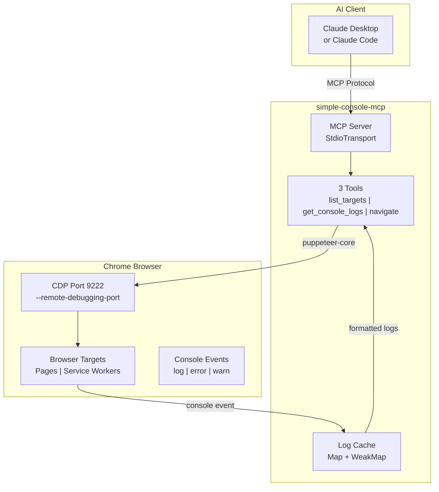
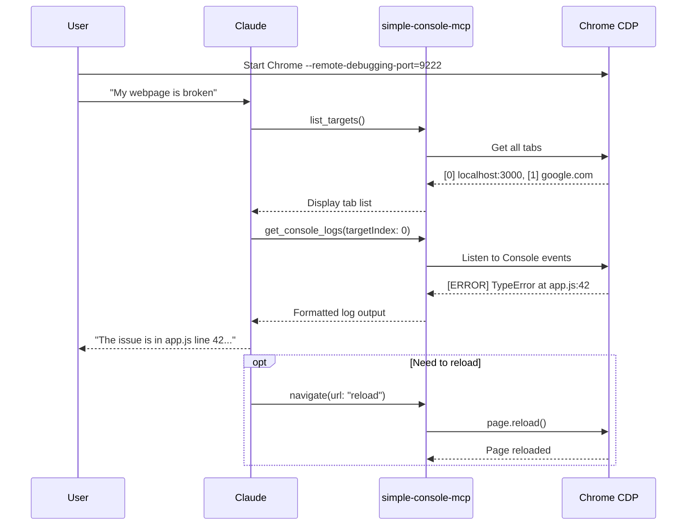

# simple-console-mcp

[](https://opensource.org/licenses/Apache-2.0)
[](https://www.npmjs.com/package/simple-console-mcp)
[](https://nodejs.org/)
[](https://modelcontextprotocol.io/)

[← Back to Muripo HQ](https://tznthou.github.io/muripo-hq/)

> Minimal Console MCP — The smallest unit for browser debugging

[中文版](README.md)

---

## TL;DR

An extremely minimal MCP Server focused solely on browser Console Log monitoring. **97% lighter** than chrome-devtools-mcp (3 tools vs 50+), so your AI assistant won't consume a ton of context tokens while debugging.

| Comparison | chrome-devtools-mcp | simple-console-mcp |
|------------|---------------------|-------------------|
| Tools | 50+ | **3** |
| Context Cost | ~5000 tokens | **~160 tokens** |
| Focus | Full-featured | Console only |

---

## Why I Built This

This project started with a simple question: **"I just want to see Console Logs. Why do I need 50 tools?"**

chrome-devtools-mcp is powerful, but every time the AI calls a tool, it needs to understand all 50+ tools first. The tool descriptions alone consume a huge amount of context. For scenarios where you just want to quickly debug JavaScript errors, that's wasteful.

So I built this "**Minimum Viable MCP**":

- `list_targets` — List browser tabs
- `get_console_logs` — Read Console output
- `navigate` — Navigate or reload

Just three tools. Good enough.

---

## Architecture



---

## Usage Flow



---

## Installation

### Option 1: npm (Recommended)

Add to your Claude Desktop or Claude Code MCP settings:

```json
{
  "mcpServers": {
    "simple-console": {
      "command": "npx",
      "args": ["-y", "simple-console-mcp"]
    }
  }
}
```

### Option 2: GitHub URL

```json
{
  "mcpServers": {
    "simple-console": {
      "command": "npx",
      "args": ["-y", "github:tznthou/simple-console-mcp"]
    }
  }
}
```

### Option 3: Local Installation

```bash
git clone https://github.com/tznthou/simple-console-mcp.git
cd simple-console-mcp && npm install
```

```json
{
  "mcpServers": {
    "simple-console": {
      "command": "node",
      "args": ["/path/to/simple-console-mcp/src/index.js"]
    }
  }
}
```

---

## Starting Chrome CDP

The MCP Server needs to connect to Chrome's DevTools Protocol. Start Chrome with the `--remote-debugging-port` flag:

```bash
# macOS
/Applications/Google\ Chrome.app/Contents/MacOS/Google\ Chrome --remote-debugging-port=9222

# Linux
google-chrome --remote-debugging-port=9222

# Windows
"C:\Program Files\Google\Chrome\Application\chrome.exe" --remote-debugging-port=9222
```

Or use the included convenience script:

```bash
./bin/start-chrome.sh
```

---

## Tools

### `list_targets`

List all available browser targets (pages, Service Workers, etc.).

| Parameter | Type | Default | Description |
|-----------|------|---------|-------------|
| `port` | number | 9222 | Chrome CDP port |

```
Available targets:
[0] page: http://localhost:3000 (title: "My App")
[1] service_worker: chrome-extension://xxx/background.js
[2] page: chrome-extension://xxx/popup.html
```

### `get_console_logs`

Get Console output from a specific target. Starts monitoring on first call.

| Parameter | Type | Default | Description |
|-----------|------|---------|-------------|
| `targetIndex` | number | 0 | Target index from list_targets |
| `maxLines` | number | 50 | Maximum lines to return |
| `filter` | string | "all" | Filter type: all / error / warn / log / info / debug |
| `port` | number | 9222 | Chrome CDP port |

```
=== Console Logs for http://localhost:3000 ===
[12:34:56] ERROR: Uncaught TypeError: Cannot read property 'x' of undefined
[12:34:57] WARN: Deprecation warning...
(showing 2 of 50 total logs, filter: all)
```

### `navigate`

Navigate to a URL or reload the page.

| Parameter | Type | Default | Description |
|-----------|------|---------|-------------|
| `url` | string | - | Target URL or "reload" |
| `targetIndex` | number | 0 | Target index |
| `port` | number | 9222 | Chrome CDP port |

```
Navigated to: http://localhost:3000/login
Page title: "Login"
(Console logs cleared)
```

---

## Chrome Extension Development

This MCP supports monitoring Console output from Chrome Extensions:

```
[0] page: http://localhost:3000           ← Regular webpage
[1] service_worker: chrome-extension://abc/background.js  ← Extension background script
[2] page: chrome-extension://abc/popup.html               ← Extension popup
```

Use different `targetIndex` values to monitor each target separately.

---

## Tech Stack

| Technology | Purpose |
|------------|---------|
| Node.js 18+ | Runtime |
| ES Modules | Module system |
| @modelcontextprotocol/sdk | MCP protocol implementation |
| puppeteer-core | Chrome CDP connection (no bundled Chromium) |
| zod | Parameter validation |

---

## Project Structure

```
simple-console-mcp/
├── src/
│   └── index.js        # MCP Server main code (~200 lines)
├── bin/
│   └── start-chrome.sh # Chrome startup script
├── package.json
├── README.md           # Chinese docs
├── README_EN.md        # English docs
└── LICENSE             # Apache-2.0
```

---

## Requirements

| Item | Requirement |
|------|-------------|
| Node.js | 18+ |
| Chrome | Any version with `--remote-debugging-port` enabled |
| OS | macOS / Linux / Windows |

---

## Notes

1. **Chrome must have CDP enabled**: Chrome without `--remote-debugging-port` cannot be connected
2. **One Chrome at a time**: If multiple Chrome instances exist, MCP connects to the first one
3. **Log cache limit**: Each target keeps at most 500 logs, older ones are automatically removed
4. **Navigation clears logs**: Calling navigate clears the target's log cache

---

## License

[](https://opensource.org/licenses/Apache-2.0)

This project is licensed under the [Apache License 2.0](LICENSE).

---

## Author

- GitHub: [@tznthou](https://github.com/tznthou)
- Part of [muripo 30-day challenge](https://github.com/tznthou/muripo-hq) - Day 14
