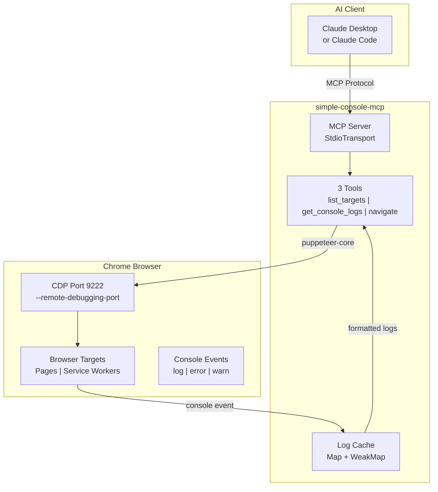
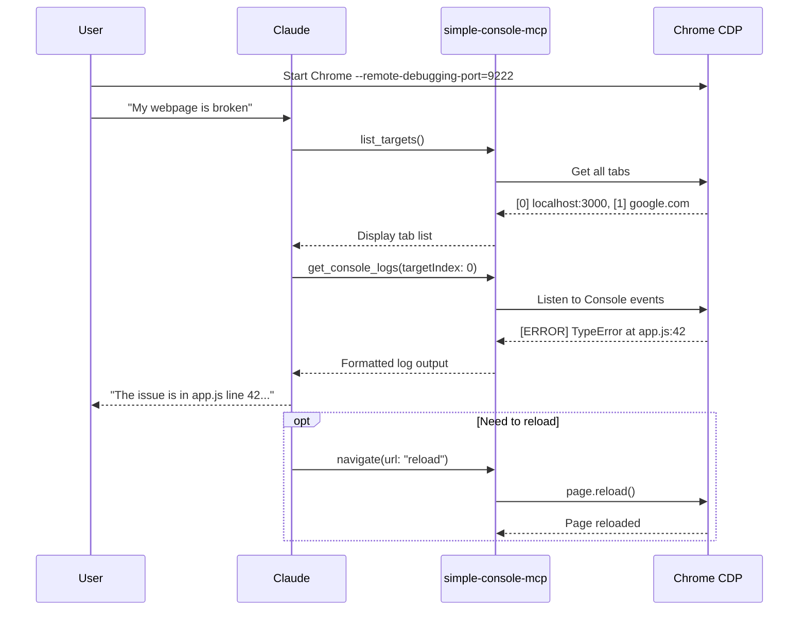

# simple-console-mcp

[](https://opensource.org/licenses/Apache-2.0)
[](https://www.npmjs.com/package/simple-console-mcp)
[](https://nodejs.org/)
[](https://modelcontextprotocol.io/)

[← Back to Muripo HQ](https://tznthou.github.io/muripo-hq/)

> Minimal Console MCP — The smallest unit for browser debugging

[中文版](README.md)

---

## TL;DR

An extremely minimal MCP Server focused solely on browser Console Log monitoring. **97% lighter** than chrome-devtools-mcp (3 tools vs 50+), so your AI assistant won't consume a ton of context tokens while debugging.

| Comparison | chrome-devtools-mcp | simple-console-mcp |
|------------|---------------------|-------------------|
| Tools | 50+ | **3** |
| Context Cost | ~5000 tokens | **~160 tokens** |
| Focus | Full-featured | Console only |

---

## Why I Built This

This project started with a simple question: **"I just want to see Console Logs. Why do I need 50 tools?"**

chrome-devtools-mcp is powerful, but every time the AI calls a tool, it needs to understand all 50+ tools first. The tool descriptions alone consume a huge amount of context. For scenarios where you just want to quickly debug JavaScript errors, that's wasteful.

So I built this "**Minimum Viable MCP**":

- `list_targets` — List browser tabs
- `get_console_logs` — Read Console output
- `navigate` — Navigate or reload

Just three tools. Good enough.

The core goal of this MCP is to fully embrace the **subtraction principle** — achieve maximum effect with minimum functionality. It's also an application of the **80/20 rule**: if 80% of debugging scenarios only need Console Logs, why load 100% of the tools?

I believe this is probably the world's smallest MCP for Console Log monitoring. I'm quite proud of that. This was also my first time building an MCP tool, and through the process I learned how to publish packages to npm for anyone in the world to download. I'm not sure if others will adopt this tool, but at least it's very useful for me.

That said, this MCP might seem a bit pointless to non-Vibe Coders — real engineers already know how to read Console Logs themselves, no AI needed. So this is more of a practice project to gain experience. But hey, taking an idea from zero to publishing on npm is valuable in itself.

---

## Test Verification

Tested with [Cyber Reality Glitcher](https://tznthou.github.io/day-13-cyber-glitch/) (Muripo Day 13) as the test webpage. All features verified working:

```
$ list_targets
Available targets:
[0] page: http://localhost:3000/ (title: "loading...")

$ get_console_logs
=== Console Logs for http://localhost:3000/ ===
[00:02:50] WARN: cdn.tailwindcss.com should not be used in production...
[00:02:51] LOG: %c[CYBER_GLITCHER] Reality has been compromised.
[00:02:51] LOG: %cHover text to scramble | Click to zap | Shift+Click to lock
(showing 3 of 3 total logs, filter: all)

$ get_console_logs --filter=warn
[00:02:50] WARN: cdn.tailwindcss.com should not be used in production...
(showing 3 of 3 total logs, filter: warn)

$ navigate --url=http://localhost:3000/index.html
Navigated to: http://localhost:3000/index.html
Page title: "Cyber Reality Glitcher - Muripo Day 13"
(Console logs cleared)
```

| Feature | Status |
|---------|--------|
| `list_targets` | ✅ Successfully lists browser tabs |
| `get_console_logs` | ✅ Successfully reads Console output |
| `navigate` | ✅ Successfully navigates pages |
| `filter` param | ✅ Successfully filters log types |
| Auto-launch Chrome | ✅ v1.2.0 fixed isolated profile issue |
| Security Fixes | ✅ v1.3.0 fixed command injection, race condition, etc. |
| Index Consistency | ✅ v1.3.1 fixed navigate vs list_targets index mismatch |
| URL Protocol Validation | ✅ v1.4.0 blocks javascript:/file:// injection attacks |
| Version Sync | ✅ v1.4.0 auto-reads from package.json, never out of sync |

---

## Architecture



---

## Usage Flow



---

## Installation

### Option 1: npm (Recommended)

**Claude Code (one-liner):**

```bash
claude mcp add simple-console -- npx -y simple-console-mcp
```

**Claude Desktop** or other MCP clients ([Cursor](https://docs.cursor.com/context/model-context-protocol) / [Windsurf](https://docs.windsurf.com/windsurf/mcp) / [Cline](https://docs.cline.bot/mcp-servers/configuring-mcp-servers)):

```json
{
  "mcpServers": {
    "simple-console": {
      "command": "npx",
      "args": ["-y", "simple-console-mcp"]
    }
  }
}
```

### Option 2: GitHub URL

**Claude Code:**

```bash
claude mcp add simple-console -- npx -y github:tznthou/simple-console-mcp
```

**Manual config:**

```json
{
  "mcpServers": {
    "simple-console": {
      "command": "npx",
      "args": ["-y", "github:tznthou/simple-console-mcp"]
    }
  }
}
```

### Option 3: Local Installation

```bash
git clone https://github.com/tznthou/simple-console-mcp.git
cd simple-console-mcp && npm install
```

**Claude Code:**

```bash
claude mcp add simple-console -- node /path/to/simple-console-mcp/src/index.js
```

**Manual config:**

```json
{
  "mcpServers": {
    "simple-console": {
      "command": "node",
      "args": ["/path/to/simple-console-mcp/src/index.js"]
    }
  }
}
```

---

## Starting Chrome CDP

### Auto-launch (v1.1.0+)

**No manual setup required!** The MCP automatically detects whether Chrome has CDP enabled:
- If CDP is already enabled → connects directly
- If not → **auto-launches** a new Chrome with CDP

Just install the MCP, and tell Claude "help me debug" — it handles everything automatically.

### Manual Start (Fallback)

If auto-launch fails, you can start Chrome manually:

```bash
# macOS
/Applications/Google\ Chrome.app/Contents/MacOS/Google\ Chrome --remote-debugging-port=9222

# Linux
google-chrome --remote-debugging-port=9222

# Windows
"C:\Program Files\Google\Chrome\Application\chrome.exe" --remote-debugging-port=9222
```

Or use the included convenience script:

```bash
./bin/start-chrome.sh
```

> **Note**: If you already have a "normal" Chrome open (without CDP), the MCP will launch a **new** Chrome window. You'll need to open the webpage you want to debug in that new window.

---

## Tools

### `list_targets`

List all available browser targets (pages, Service Workers, etc.).

| Parameter | Type | Default | Description |
|-----------|------|---------|-------------|
| `port` | number | 9222 | Chrome CDP port |

```
Available targets:
[0] page: http://localhost:3000 (title: "My App")
[1] service_worker: chrome-extension://xxx/background.js
[2] page: chrome-extension://xxx/popup.html
```

### `get_console_logs`

Get Console output from a specific target. Starts monitoring on first call.

| Parameter | Type | Default | Description |
|-----------|------|---------|-------------|
| `targetIndex` | number | 0 | Target index from list_targets |
| `maxLines` | number | 50 | Maximum lines to return |
| `filter` | string | "all" | Filter type: all / error / warn / log / info / debug |
| `port` | number | 9222 | Chrome CDP port |

```
=== Console Logs for http://localhost:3000 ===
[12:34:56] ERROR: Uncaught TypeError: Cannot read property 'x' of undefined
[12:34:57] WARN: Deprecation warning...
(showing 2 of 50 total logs, filter: all)
```

### `navigate`

Navigate to a URL or reload the page.

| Parameter | Type | Default | Description |
|-----------|------|---------|-------------|
| `url` | string | - | Target URL or "reload" |
| `targetIndex` | number | 0 | Target index |
| `port` | number | 9222 | Chrome CDP port |

```
Navigated to: http://localhost:3000/login
Page title: "Login"
(Console logs cleared)
```

---

## Chrome Extension Development

This MCP supports monitoring Console output from Chrome Extensions:

```
[0] page: http://localhost:3000           ← Regular webpage
[1] service_worker: chrome-extension://abc/background.js  ← Extension background script
[2] page: chrome-extension://abc/popup.html               ← Extension popup
```

Use different `targetIndex` values to monitor each target separately.

---

## How It Works: Pull-based

```
Claude calls get_console_logs → MCP returns accumulated logs → Claude processes
         ↑                                                        |
         └──────────────── Claude must call again ────────────────┘
```

**Behavior**:
1. On first `get_console_logs` call, MCP starts monitoring that target
2. Console events are continuously collected in memory (max 500 entries)
3. **Claude does NOT receive automatic notifications** — must call `get_console_logs` again to see new logs

> **Why Pull-based?**
> MCP protocol is request-response based and doesn't support push notifications. The server cannot proactively tell Claude "there's a new error" — Claude must actively ask.

### Real Usage Example

```
You: "Help me debug this page"
Claude: [calls list_targets]
Claude: [calls get_console_logs]
Claude: "No errors found, the page looks fine."

You: "I clicked that button and the page broke"
Claude: [calls get_console_logs again]  ← needs your prompt to check again
Claude: "Found new error: TypeError at app.js:42..."
```

---

## Tech Stack

| Technology | Purpose |
|------------|---------|
| Node.js 18+ | Runtime |
| ES Modules | Module system |
| @modelcontextprotocol/sdk | MCP protocol implementation |
| puppeteer-core | Chrome CDP connection (no bundled Chromium) |
| zod | Parameter validation |

---

## Project Structure

```
simple-console-mcp/
├── src/
│   └── index.js        # MCP Server main code (~440 lines, security hardened)
├── bin/
│   └── start-chrome.sh # Chrome startup script
├── package.json
├── README.md           # Chinese docs
├── README_EN.md        # English docs
└── LICENSE             # Apache-2.0
```

---

## Requirements

| Item | Requirement |
|------|-------------|
| Node.js | 18+ |
| Chrome | Any version with `--remote-debugging-port` enabled |
| OS | macOS / Linux / Windows |

---

## Notes

1. **Chrome must have CDP enabled**: Chrome without `--remote-debugging-port` cannot be connected
2. **One Chrome at a time**: If multiple Chrome instances exist, MCP connects to the first one
3. **Log cache limit**: Each target keeps at most 500 logs, older ones are automatically removed
4. **Navigation clears logs**: Calling navigate clears the target's log cache

---

## Changelog

### v1.4.0 (2025-12-17)

**Security Hardening** (comprehensive code review fixes):

| Issue | Severity | Fix |
|-------|----------|-----|
| URL Protocol Injection | 🔴 Critical | Added `validateUrl()` allowing only `http://` and `https://`, blocking `javascript:` and `file://` |
| Shell Command Injection | 🔴 Critical | `start-chrome.sh` now validates port must be integer 1024-65535 |
| Cleanup Race Condition | 🔴 Critical | Added `isCleaningUp` flag, copy keys before iteration, `uncaughtException` handler |
| Private API Dependency | 🟠 High | `getTargetId()` prefers official API, falls back to `_targetId` |
| Incomplete Resource Cleanup | 🟠 High | Added `browser.isConnected()` check before disconnect |
| Inconsistent Error Handling | 🟠 High | Added `createErrorResponse()` for unified error format |
| Magic String | 🟠 High | Added `PAGE_LOAD_WAIT_UNTIL` constant |
| Missing HTTP Warning | 🟡 Medium | Non-localhost HTTP URLs now show security warning |
| Unlimited URL Length | 🟡 Medium | Added `MAX_URL_LENGTH = 2048` limit to prevent DoS |
| Chrome Path Unchecked | 🔵 Low | macOS/Windows check Chrome exists before launch |
| Node Version Undeclared | 🔵 Low | Added `engines.node >= 18` to `package.json` |

**Improvements**:
- ✨ Auto-synced version: reads from `package.json`, never out of sync
- ✨ `list_targets` removed broken title display (`t.page` was always undefined)
- ✨ `get_console_logs` footer stats fixed, now correctly shows filtered/total counts
- 📦 Code grew from ~340 to ~440 lines, all security hardening

### v1.3.1 (2025-12-13)

**Bug Fix**:
- 🐛 Fixed `navigate` tool's `targetIndex` inconsistency with `list_targets`
  - **Problem**: `navigate` only filtered `page` types, while `list_targets` included `service_worker` and `background_page`, causing the same page to show different indexes across tools
  - **Fix**: Unified all tools to use the same target filtering logic, with friendly error messages for non-page targets

### v1.3.0 (2025-12-13)

**Security Fixes** (thanks to Code Review for identifying these issues):

| Issue | Severity | Fix |
|-------|----------|-----|
| Command Injection | 🔴 Critical | Added `validatePort()` to ensure port is integer between 1024-65535 |
| Path Traversal | 🔴 Critical | Same as above, prevents `../` in `port` parameter |
| Race Condition | 🔴 Critical | Used Promise lock to prevent parallel connections spawning multiple Chrome instances |
| Resource Leak | 🔴 Critical | Added `SIGINT/SIGTERM` handlers to cleanup browser connections |
| targetId Confusion | 🟠 High | Changed to use Puppeteer's internal `_targetId` instead of URL as identifier |
| pageCache Key Error | 🟠 High | Changed to use `targetId` instead of `targetIndex` as cache key |

**Improvements**:
- ✨ Enhanced parameter validation: Zod schema now includes `.int().min().max()` constraints
- ✨ Better error handling: Added server-side `console.error` logging
- ✨ Standardized timestamps: Changed to ISO 8601 format (`toISOString()`)
- ✨ Code quality: Extracted magic numbers into named constants

### v1.2.0 (2025-12-12)

- 🔧 Auto-launched Chrome now uses isolated `user-data-dir` to avoid conflicts with existing Chrome profiles

### v1.1.0 (2025-12-12)

- ✨ Added auto-launch Chrome CDP feature

### v1.0.0 (2025-12-12)

- 🎉 Initial release

---

## License

[](https://opensource.org/licenses/Apache-2.0)

This project is licensed under the [Apache License 2.0](LICENSE).

---

## Author

- GitHub: [@tznthou](https://github.com/tznthou)
