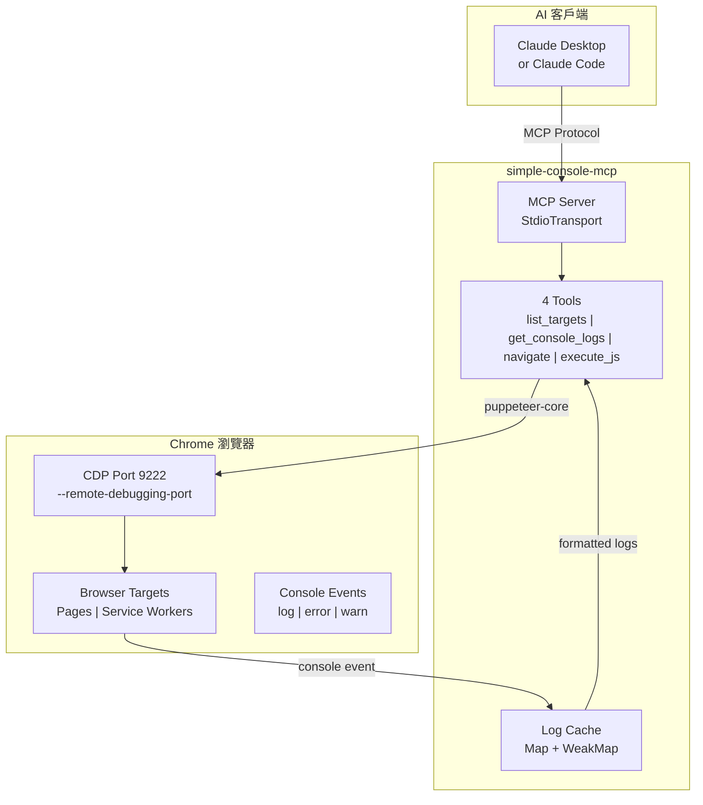

# simple-console-mcp

[](https://opensource.org/licenses/Apache-2.0)
[](https://www.npmjs.com/package/simple-console-mcp)
[](https://nodejs.org/)
[](https://modelcontextprotocol.io/)

[← 回到 Muripo HQ](https://tznthou.github.io/muripo-hq/)

> 極簡 Console MCP — 瀏覽器除錯的最小單位

[English Version](README.md)

---

## TL;DR

一個極度精簡的 MCP Server，專注於瀏覽器 Console Log 監聽。比 chrome-devtools-mcp 輕 **97%**（4 個工具 vs 50+），讓 AI 助手幫你 debug 時不會吃掉一堆 context token。

| 對比 | chrome-devtools-mcp | simple-console-mcp |
|------|---------------------|-------------------|
| 工具數 | 50+ | **4** |
| Context 消耗 | ~5000 tokens | **~200 tokens** |
| 功能 | 全功能 | Console + JS 執行 |

---

## 開發心得

這個專案源自一個簡單的問題：**「我只想看 Console Log，為什麼要載入 50 個工具？」**

chrome-devtools-mcp 很強大，但每次 AI 呼叫工具前都要先理解這 50+ 個工具的用途，光是工具描述就吃掉大量 context。對於只想快速 debug JavaScript 錯誤的場景來說，這太浪費了。

所以我做了這個「**最小可行 MCP**」：

- `list_targets` — 列出瀏覽器分頁
- `get_console_logs` — 讀取 Console 輸出
- `navigate` — 導航或重新整理
- `execute_js` — 在頁面執行 JavaScript

就這四個。夠用就好。

這個 MCP 的核心目標，是徹底執行**減法原則**——用最小的功能達成最大的效果。實際上，這也是 **80/20 法則**的運用：80% 的 debug 場景只需要看 Console Log，那為什麼要載入 100% 的工具？

---

## 測試驗證

所有功能都經過完整的測試套件驗證：

### 測試場景

| 測試 | 描述 | 狀態 |
|------|------|------|
| **01-basic-logs** | console.log, warn, error, info, debug | ✅ 通過 |
| **02-js-errors** | TypeError, ReferenceError, SyntaxError, RangeError | ✅ 通過 |
| **03-async-errors** | Promise rejection, async/await, setTimeout, fetch 錯誤 | ✅ 通過 |
| **04-stress-test** | 產生 600 條 log，驗證 500 上限正常運作 | ✅ 通過 |
| **05-special-chars** | Emoji、中文、日文、JSON 物件、Unicode | ✅ 通過 |

### 功能驗證

| 功能 | 狀態 |
|------|------|
| `list_targets` - 列出瀏覽器分頁 | ✅ |
| `get_console_logs` - 讀取 console 輸出 | ✅ |
| `navigate` - 導航或重新載入頁面 | ✅ |
| `execute_js` - 在頁面執行 JavaScript | ✅ |
| `filter` 參數 - 過濾 log 類型 | ✅ |
| 自動啟動 debug 模式 Chrome | ✅ |
| 獨立 user-data-dir (`/tmp/chrome-cdp-9222`) | ✅ |
| 500 條 log 快取上限 | ✅ |
| `execute_js` 5 秒執行超時 | ✅ |
| Chrome 衝突時的明確錯誤訊息 | ✅ |

---

## 安裝方式

### 方法一：npm（推薦）

**Claude Code（一行搞定）：**

```bash
claude mcp add simple-console -- npx -y simple-console-mcp
```

**Claude Desktop** 或其他 MCP 客戶端（[Cursor](https://docs.cursor.com/context/model-context-protocol) / [Windsurf](https://docs.windsurf.com/windsurf/mcp) / [Cline](https://docs.cline.bot/mcp-servers/configuring-mcp-servers)）：

```json
{
  "mcpServers": {
    "simple-console": {
      "command": "npx",
      "args": ["-y", "simple-console-mcp"]
    }
  }
}
```

### 方法二：GitHub URL

**Claude Code：**

```bash
claude mcp add simple-console -- npx -y github:tznthou/simple-console-mcp
```

### 方法三：本地安裝

```bash
git clone https://github.com/tznthou/simple-console-mcp.git
cd simple-console-mcp && npm install
```

```bash
claude mcp add simple-console -- node /path/to/simple-console-mcp/src/index.js
```

---

## 啟動 Chrome CDP

### 自動啟動（v1.1.0+）

**不需要手動操作！** MCP 會自動偵測 Chrome 是否已開啟 CDP：
- 如果已開啟 → 直接連接
- 如果未開啟 → **自動啟動**一個帶 debug 模式的獨立 Chrome

只要安裝好 MCP，對 Claude 說「幫我 debug」就會自動處理。

> **注意（v1.4.0+）**：如果你已經開著普通的 Chrome，MCP 會顯示明確的錯誤訊息，請你先關閉它。這是為了避免普通 Chrome 和 debug Chrome 之間的衝突。

### 手動啟動（備用）

如果自動啟動失敗，可以手動執行：

```bash
# macOS
/Applications/Google\ Chrome.app/Contents/MacOS/Google\ Chrome --remote-debugging-port=9222

# Linux
google-chrome --remote-debugging-port=9222

# Windows
"C:\Program Files\Google\Chrome\Application\chrome.exe" --remote-debugging-port=9222
```

---

## 工具說明

### `list_targets`

列出所有可監聽的瀏覽器目標（頁面、Service Worker 等）。

| 參數 | 類型 | 預設值 | 說明 |
|------|------|--------|------|
| `port` | number | 9222 | Chrome CDP 連接埠 |

```
Available targets:
[0] page: http://localhost:3000
[1] service_worker: chrome-extension://xxx/background.js
[2] page: chrome-extension://xxx/popup.html
```

### `get_console_logs`

取得指定目標的 Console 輸出。首次呼叫會開始監聽。

| 參數 | 類型 | 預設值 | 說明 |
|------|------|--------|------|
| `targetIndex` | number | 0 | 目標索引（從 list_targets 取得） |
| `maxLines` | number | 50 | 最大回傳行數 |
| `filter` | string | "all" | 過濾類型：all / error / warn / log / info / debug |
| `port` | number | 9222 | Chrome CDP 連接埠 |

```
=== Console Logs for http://localhost:3000 ===
[12:34:56] ERROR: Uncaught TypeError: Cannot read property 'x' of undefined
[12:34:57] WARN: Deprecation warning...
(showing 2 of 50 total logs, filter: all)
```

### `navigate`

導航到指定 URL 或重新整理頁面。

| 參數 | 類型 | 預設值 | 說明 |
|------|------|--------|------|
| `url` | string | - | 目標 URL 或 "reload" |
| `targetIndex` | number | 0 | 目標索引 |
| `port` | number | 9222 | Chrome CDP 連接埠 |

```
Navigated to: http://localhost:3000/login
Page title: "Login"
(Console logs cleared)
```

### `execute_js`（v1.4.0 新增）

在頁面 context 中執行 JavaScript。可用於點擊按鈕、填寫表單、讀取 DOM 或呼叫頁面函數。

| 參數 | 類型 | 預設值 | 說明 |
|------|------|--------|------|
| `code` | string | - | 要執行的 JavaScript 代碼（最多 10,000 字元） |
| `targetIndex` | number | 0 | 目標索引 |
| `port` | number | 9222 | Chrome CDP 連接埠 |

**安全措施：**
- 代碼長度限制：10,000 字元
- 執行超時：5 秒
- 結果大小限制：50,000 字元

**使用範例：**

```javascript
// 點擊按鈕
document.querySelector('button#submit').click()

// 讀取頁面標題
document.title

// 呼叫頁面函數
myApp.doSomething()

// 填寫表單
document.getElementById('email').value = 'test@example.com'

// 取得元素數量
document.querySelectorAll('.item').length
```

```
=== JavaScript Executed ===
Code: document.title

Result:
"My Application"
```

---

## 系統架構



---

## 運作機制：Pull-based（被動式）

```
Claude 呼叫 get_console_logs → MCP 回傳累積的 logs → Claude 處理
         ↑                                              |
         └──────────── Claude 必須再次呼叫 ──────────────┘
```

**行為說明**：
1. 第一次呼叫 `get_console_logs` 時，MCP 開始監聽該 target
2. Console 事件持續被收集到記憶體（最多 500 條）
3. **Claude 不會自動收到通知** — 必須再次呼叫 `get_console_logs` 才能看到新 log

> **為什麼是 Pull-based？**
> MCP 協議是 request-response 模式，不支援主動推送。Server 無法主動通知 Claude「有新錯誤」，Claude 必須主動詢問。

---

## Chrome Extension 開發

這個 MCP 支援監聽 Chrome Extension 的 Console 輸出：

```
[0] page: http://localhost:3000           ← 一般網頁
[1] service_worker: chrome-extension://abc/background.js  ← Extension 背景腳本
[2] page: chrome-extension://abc/popup.html               ← Extension 彈出視窗
```

用不同的 `targetIndex` 分別監聽各個目標。

---

## 技術棧

| 技術 | 用途 |
|------|------|
| Node.js 18+ | 執行環境 |
| ES Modules | 模組系統 |
| @modelcontextprotocol/sdk | MCP 協議實作 |
| puppeteer-core | Chrome CDP 連接（不含 Chromium） |
| zod | 參數驗證 |

---

## 專案結構

```
simple-console-mcp/
├── src/
│   └── index.js        # MCP Server 主程式（~550 行，含安全性強化）
├── bin/
│   └── start-chrome.sh # Chrome 啟動腳本
├── package.json
├── README.md           # 英文說明
├── README_ZH.md        # 中文說明（本檔案）
└── LICENSE             # Apache-2.0
```

---

## 環境需求

| 項目 | 需求 |
|------|------|
| Node.js | 18+ |
| Chrome | 任意版本，需開啟 `--remote-debugging-port` |
| 作業系統 | macOS / Linux / Windows |

---

## 注意事項

1. **Chrome 必須開啟 CDP**：沒有 `--remote-debugging-port` 參數的 Chrome 無法連接
2. **一次只能連一個 Chrome**：如果有多個 Chrome 實例，MCP 會連接到第一個
3. **Log 快取上限**：每個目標最多保留 500 條 Log，超過會自動清除舊的
4. **導航會清除 Log**：呼叫 navigate 後，該目標的 Log 會被清空

---

## 更新日誌

### v1.4.0 (2025-12-17)

**新功能：**
- ✨ **`execute_js` 工具**：在頁面 context 中執行 JavaScript
  - 可用於點擊按鈕、填寫表單、讀取 DOM、呼叫頁面函數
  - 安全措施：5 秒超時、10K 代碼限制、50K 結果限制
- ✨ **簡化 Chrome 啟動邏輯**：
  - 直接啟動帶獨立 profile 的 debug Chrome（`/tmp/chrome-cdp-9222`）
  - 當普通 Chrome 與 debug Chrome 衝突時，顯示明確的錯誤訊息

**改善項目：**
- 📦 程式碼從 ~460 行增加到 ~550 行（+20%）
- 🔧 移除自動關閉 Chrome 邏輯（用戶需手動關閉普通 Chrome）
- 📝 改善錯誤訊息，更清楚說明 Chrome 衝突的解決方式

### v1.3.6 (2025-12-17)

**安全性強化**（全面 Code Review 後的修復）：

| 問題 | 嚴重性 | 修復方式 |
|------|--------|----------|
| URL 協議注入 | 🔴 Critical | 新增 `validateUrl()` 只允許 `http://` 和 `https://` |
| Shell 命令注入 | 🔴 Critical | `start-chrome.sh` 加入 port 驗證 |
| 清理競態條件 | 🔴 Critical | 新增 `isCleaningUp` flag、`uncaughtException` handler |
| 私有 API 依賴 | 🟠 High | `getTargetId()` 優先使用官方 API |
| 資源清理不完整 | 🟠 High | 新增 `browser.isConnected()` 檢查 |
| HTTP 警告缺失 | 🟡 Medium | 非 localhost 的 HTTP URL 會顯示安全警告 |
| URL 長度無限 | 🟡 Medium | 新增 `MAX_URL_LENGTH = 2048` 限制 |

### v1.3.1 (2025-12-13)

- 🐛 修復 `navigate` 工具的 `targetIndex` 與 `list_targets` 不一致問題

### v1.3.0 (2025-12-13)

**安全性修復：**

| 問題 | 嚴重性 | 修復方式 |
|------|--------|----------|
| 命令注入漏洞 | 🔴 Critical | 加入 `validatePort()` |
| Race Condition | 🔴 Critical | 使用 Promise lock |
| 資源洩漏 | 🔴 Critical | 加入 `SIGINT/SIGTERM` handler |

### v1.2.0 (2025-12-12)

- 🔧 自動啟動 Chrome 時使用獨立 `user-data-dir`

### v1.1.0 (2025-12-12)

- ✨ 新增自動啟動 Chrome CDP 功能

### v1.0.0 (2025-12-12)

- 🎉 首次發布

---

## 授權

[](https://opensource.org/licenses/Apache-2.0)

本專案採用 [Apache License 2.0](LICENSE) 授權。

---

## 作者

- GitHub: [@tznthou](https://github.com/tznthou)
