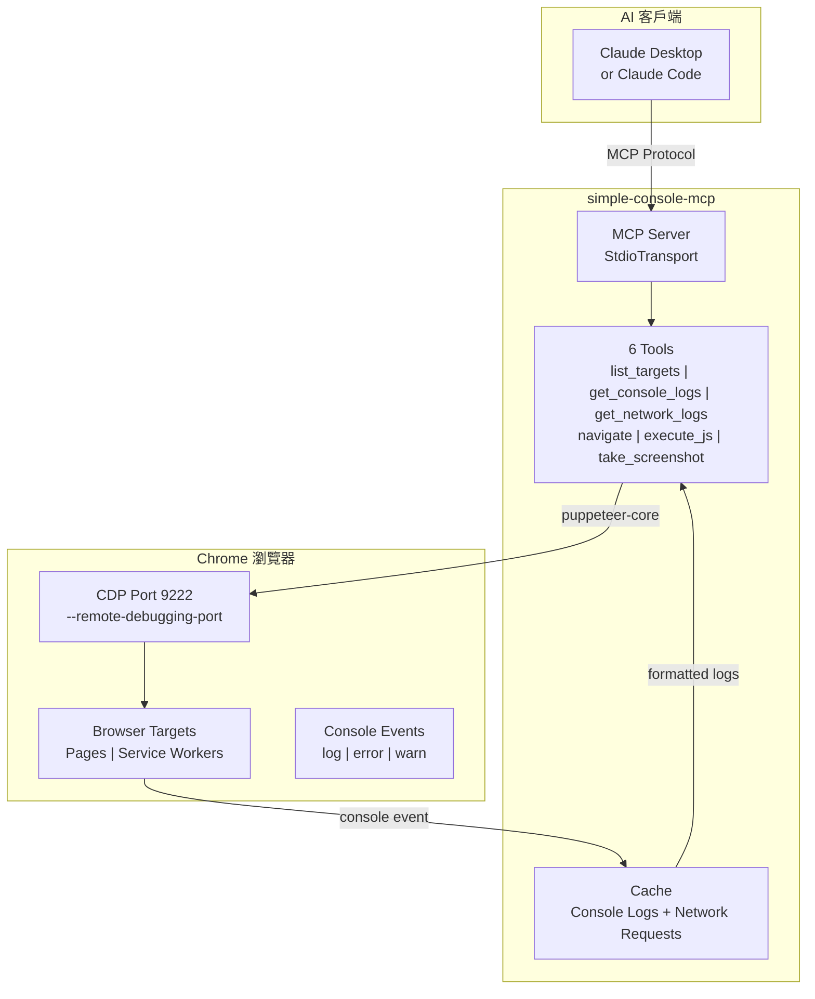

# Simple Console MCP

[](https://opensource.org/licenses/Apache-2.0)
[](https://www.npmjs.com/package/simple-console-mcp)
[](https://nodejs.org/)
[](https://modelcontextprotocol.io/)

[← 回到 Muripo HQ](https://tznthou.github.io/muripo-hq/)

> 6 個工具，85% 的除錯場景。AI 輔助瀏覽器除錯的最佳信噪比。

[English Version](README.md)

---

## TL;DR

一個精簡的 MCP Server，專注於瀏覽器除錯核心需求。**6 個工具 vs 26+**（chrome-devtools-mcp），讓 AI 助手用最佳信噪比幫你 debug。

| 對比 | chrome-devtools-mcp | simple-console-mcp |
|------|---------------------|-------------------|
| 工具數 | 26+ | **6** |
| Context 消耗 | ~5000 tokens | **~350 tokens** |
| 功能 | 全功能 | Console + Network + Screenshot + JS |

---

## 開發心得

這個專案源自一個簡單的問題：**「我只想 debug 我的 web app，為什麼要載入 30 個工具？」**

chrome-devtools-mcp 很強大，但工具越多、AI 的認知負擔越大——回應更慢、選錯工具的機率更高。日常除錯需要的是高信噪比，不是瑞士刀。

所以我做了這個「**最小可行 MCP**」，用 6 個工具覆蓋 ~85% 的除錯場景：

- `list_targets` — 列出瀏覽器分頁
- `get_console_logs` — 讀取 Console 輸出
- `get_network_logs` — 監控 HTTP 請求/回應
- `navigate` — 導航或重新整理
- `execute_js` — 在頁面執行 JavaScript
- `take_screenshot` — 截取頁面畫面

核心目標是**最佳信噪比**——用最少的工具達成最大的除錯能力。每個工具都因為 `execute_js` 無法替代而存在。

---

## 安裝方式

### 方法一：npm（推薦）

**Claude Code（一行搞定）：**

```bash
claude mcp add simple-console -- npx -y simple-console-mcp
```

**Claude Desktop** 或其他 MCP 客戶端（[Cursor](https://docs.cursor.com/context/model-context-protocol) / [Windsurf](https://docs.windsurf.com/windsurf/mcp) / [Cline](https://docs.cline.bot/mcp-servers/configuring-mcp-servers)）：

```json
{
  "mcpServers": {
    "simple-console": {
      "command": "npx",
      "args": ["-y", "simple-console-mcp"]
    }
  }
}
```

### 方法二：GitHub URL

**Claude Code：**

```bash
claude mcp add simple-console -- npx -y github:tznthou/simple-console-mcp
```

### 方法三：本地安裝

```bash
git clone https://github.com/tznthou/simple-console-mcp.git
cd simple-console-mcp && npm install
```

```bash
claude mcp add simple-console -- node /path/to/simple-console-mcp/src/index.js
```

---

## 啟動 Chrome CDP

### 自動啟動（v1.1.0+）

**不需要手動操作！** MCP 會自動偵測 Chrome 是否已開啟 CDP：
- 如果已開啟 → 直接連接
- 如果未開啟 → **自動啟動**一個帶 debug 模式的獨立 Chrome

只要安裝好 MCP，對 Claude 說「幫我 debug」就會自動處理。

> **注意（v1.4.0+）**：如果你已經開著普通的 Chrome，MCP 會顯示明確的錯誤訊息，請你先關閉它。這是為了避免普通 Chrome 和 debug Chrome 之間的衝突。

### 手動啟動（備用）

如果自動啟動失敗，可以手動執行：

```bash
# macOS
/Applications/Google\ Chrome.app/Contents/MacOS/Google\ Chrome --remote-debugging-port=9222

# Linux
google-chrome --remote-debugging-port=9222

# Windows
"C:\Program Files\Google\Chrome\Application\chrome.exe" --remote-debugging-port=9222
```

---

## 工具說明

### `list_targets`

列出所有可監聽的瀏覽器目標（頁面、Service Worker 等）。

| 參數 | 類型 | 預設值 | 說明 |
|------|------|--------|------|
| `port` | number | 9222 | Chrome CDP 連接埠 |

```
Available targets:
[0] page: http://localhost:3000
[1] service_worker: chrome-extension://xxx/background.js
[2] page: chrome-extension://xxx/popup.html
```

### `get_console_logs`

取得指定目標的 Console 輸出。首次呼叫會開始監聽。

| 參數 | 類型 | 預設值 | 說明 |
|------|------|--------|------|
| `targetIndex` | number | 0 | 目標索引（從 list_targets 取得） |
| `maxLines` | number | 50 | 最大回傳行數 |
| `filter` | string | "all" | 過濾類型：all / error / warn / log / info / debug |
| `port` | number | 9222 | Chrome CDP 連接埠 |

```
=== Console Logs for http://localhost:3000 ===
[12:34:56] ERROR: Uncaught TypeError: Cannot read property 'x' of undefined
[12:34:57] WARN: Deprecation warning...
(showing 2 of 50 total logs, filter: all)
```

### `get_network_logs`（v1.5.0 新增）

取得指定目標的 HTTP 請求/回應紀錄。首次呼叫會開始監聽。

| 參數 | 類型 | 預設值 | 說明 |
|------|------|--------|------|
| `targetIndex` | number | 0 | 目標索引（從 list_targets 取得） |
| `maxLines` | number | 50 | 最大回傳筆數 |
| `filter` | string | "all" | 過濾類型：all / failed / xhr / fetch / document / stylesheet / script / image |
| `port` | number | 9222 | Chrome CDP 連接埠 |

```
=== Network Logs for http://localhost:3000 ===
[GET] 200 http://localhost:3000/ (120ms, 4.2KB)
[GET] 200 http://localhost:3000/api/user (85ms, 1.1KB)
[POST] 500 http://localhost:3000/api/save (230ms)
[GET] FAILED http://localhost:3000/missing.js (15ms) Error: net::ERR_FILE_NOT_FOUND
(showing 4 of 4 total, filter: all)
```

### `navigate`

導航到指定 URL 或重新整理頁面。

| 參數 | 類型 | 預設值 | 說明 |
|------|------|--------|------|
| `url` | string | - | 目標 URL 或 "reload" |
| `targetIndex` | number | 0 | 目標索引 |
| `port` | number | 9222 | Chrome CDP 連接埠 |

```
Navigated to: http://localhost:3000/login
Page title: "Login"
(Console logs cleared)
```

### `execute_js`（v1.4.0 新增）

在頁面 context 中執行 JavaScript。可用於點擊按鈕、填寫表單、讀取 DOM 或呼叫頁面函數。

| 參數 | 類型 | 預設值 | 說明 |
|------|------|--------|------|
| `code` | string | - | 要執行的 JavaScript 代碼（最多 10,000 字元） |
| `targetIndex` | number | 0 | 目標索引 |
| `port` | number | 9222 | Chrome CDP 連接埠 |

**安全措施：**
- 代碼長度限制：10,000 字元
- 執行超時：5 秒
- 結果大小限制：50,000 字元

**使用範例：**

```javascript
// 點擊按鈕
document.querySelector('button#submit').click()

// 讀取頁面標題
document.title

// 呼叫頁面函數
myApp.doSomething()

// 填寫表單
document.getElementById('email').value = 'test@example.com'

// 取得元素數量
document.querySelectorAll('.item').length
```

```
=== JavaScript Executed ===
Code: document.title

Result:
"My Application"
```

### `take_screenshot`（v1.5.0 新增）

截取當前頁面的畫面。回傳 PNG 圖片（若太大自動降級為 JPEG）。適合視覺化除錯 layout、CSS 或 UI 狀態。

| 參數 | 類型 | 預設值 | 說明 |
|------|------|--------|------|
| `targetIndex` | number | 0 | 目標索引（從 list_targets 取得） |
| `fullPage` | boolean | false | 截取整頁（true）或僅可視區域（false） |
| `port` | number | 9222 | Chrome CDP 連接埠 |

**安全措施：**
- Viewport 限制為 1280×800
- PNG 超過 500KB 時自動降級為 JPEG
- 預設 `fullPage: false` 避免超大截圖

---

## 系統架構


```mermaid
graph TB
    subgraph Client["AI 客戶端"]
        CLAUDE["Claude Desktop<br/>or Claude Code"]
    end

    subgraph MCP["simple-console-mcp"]
        SERVER["MCP Server<br/>StdioTransport"]
        TOOLS["6 Tools<br/>list_targets | get_console_logs | get_network_logs<br/>navigate | execute_js | take_screenshot"]
        CACHE["Cache<br/>Console Logs + Network Requests"]
    end

    subgraph Browser["Chrome 瀏覽器"]
        CDP["CDP Port 9222<br/>--remote-debugging-port"]
        PAGES["Browser Targets<br/>Pages | Service Workers"]
        CONSOLE["Console Events<br/>log | error | warn"]
    end

    CLAUDE --> |"MCP Protocol"| SERVER
    SERVER --> TOOLS
    TOOLS --> |"puppeteer-core"| CDP
    CDP --> PAGES
    PAGES --> |"console event"| CACHE
    CACHE --> |"formatted logs"| TOOLS
```

---

## 運作機制：Pull-based（被動式）

```
Claude 呼叫 get_console_logs → MCP 回傳累積的 logs → Claude 處理
         ↑                                              |
         └──────────── Claude 必須再次呼叫 ──────────────┘
```

**行為說明**：
1. 第一次呼叫 `get_console_logs` 時，MCP 開始監聽該 target
2. Console 事件持續被收集到記憶體（最多 500 條）
3. **Claude 不會自動收到通知** — 必須再次呼叫 `get_console_logs` 才能看到新 log

> **為什麼是 Pull-based？**
> MCP 協議是 request-response 模式，不支援主動推送。Server 無法主動通知 Claude「有新錯誤」，Claude 必須主動詢問。

---

## Chrome Extension 開發

這個 MCP 支援監聽 Chrome Extension 的 Console 輸出：

```
[0] page: http://localhost:3000           ← 一般網頁
[1] service_worker: chrome-extension://abc/background.js  ← Extension 背景腳本
[2] page: chrome-extension://abc/popup.html               ← Extension 彈出視窗
```

用不同的 `targetIndex` 分別監聽各個目標。

---

## 技術棧

| 技術 | 用途 |
|------|------|
| Node.js 18+ | 執行環境 |
| ES Modules | 模組系統 |
| @modelcontextprotocol/sdk | MCP 協議實作 |
| puppeteer-core | Chrome CDP 連接（不含 Chromium） |
| zod | 參數驗證 |

---

## 專案結構

```
simple-console-mcp/
├── src/
│   └── index.js          # MCP Server 主程式（~770 行，含安全性強化）
├── bin/
│   └── start-chrome.sh   # Chrome 啟動腳本
├── .github/
│   └── workflows/
│       └── release.yml   # Tag → GitHub Release + npm publish
├── test/                  # ��動測試頁面（HTML）
├── package.json
├── README.md              # 英文說明
├── README_ZH.md           # 中文說明（本檔案）
├── CHANGELOG.md           # ��整更新日誌
└── LICENSE                # Apache-2.0
```

---

## 環境需求

| 項目 | 需求 |
|------|------|
| Node.js | 18+ |
| Chrome | 任意版本，需開啟 `--remote-debugging-port` |
| 作業系統 | macOS / Linux / Windows |

---

## 注意事項

1. **Chrome 必須開啟 CDP**：沒有 `--remote-debugging-port` 參數的 Chrome 無法連接
2. **一次只能連一個 Chrome**：如果有多個 Chrome 實例，MCP 會連接到第一個
3. **快取上限**：每個目標最多保留 500 條 Console Log 和 200 筆 Network 紀錄，超過自動清除舊的
4. **導航會清除快取**：呼叫 navigate 後，該目標的 Console Log 和 Network 紀錄都會清空

---

## 安全性

MCP server 夾在 AI 與你的瀏覽器中間，供應鏈安全比一般套件更值得認真把關。本套件的防禦姿態：

| 層級 | 做法 |
|------|------|
| 發佈流程 | OIDC trusted publishing，release workflow 不存在長期有效的 `NPM_TOKEN` |
| GitHub Actions | 第三方 actions 全部 pin 到 full commit SHA |
| 依賴套件 | `npm audit` 零漏洞（最近驗證：2026-05-14） |
| Provenance | 每次發版都帶 [npm provenance](https://docs.npmjs.com/generating-provenance-statements) 簽章 |

最近一次強化記錄請見 [CHANGELOG.md](CHANGELOG.md)。

---

## 更新日誌

### v1.5.0 (2026-04-15)

**新功能：**
- ✨ **`get_network_logs` 工具**：監控 HTTP 請求/回應
  - Pull-based 監聽（與 console logs 相同模式）
  - 顯示 method、URL、status、duration、size
  - 過濾：all / failed / xhr / fetch / document / stylesheet / script / image
  - 每個目標 200 筆快取
- ✨ **`take_screenshot` 工具**：截取頁面畫面
  - 透過 MCP image content type 回傳 PNG 圖片
  - PNG 超過 500KB 時自動降級為 JPEG
  - Viewport 限制 1280×800，deviceScaleFactor: 1
  - 可選 `fullPage` 模式

**改善項目：**
- 🔧 提取 `getTargetPage()` 共用 helper（減少工具間重複程式碼）
- 🔧 導航時同時清除 Console 和 Network 快取
- 🔧 Cleanup handler 新增移除 network event listeners
- 📦 定位從「97% 更輕」調整為「6 tools vs 26+、最佳信噪比」

### v1.4.0 (2025-12-17)

**新功能：**
- ✨ **`execute_js` 工具**：在頁面 context 中執行 JavaScript
  - 可用於點擊按鈕、填寫表單、讀取 DOM、呼叫頁面函數
  - 安全措施：5 秒超時、10K 代碼限制、50K 結果限制
- ✨ **簡化 Chrome 啟動邏輯**：
  - 直接啟動帶獨立 profile 的 debug Chrome（`/tmp/chrome-cdp-9222`）
  - 當普通 Chrome 與 debug Chrome 衝突時，顯示明確的錯誤訊息

**改善項目：**
- 📦 程式碼從 ~460 行增加到 ~550 行（+20%）
- 🔧 移除自動關閉 Chrome 邏輯（用戶需手動關閉普通 Chrome）
- 📝 改善錯誤訊息，更清楚說明 Chrome 衝突的解決方式

完整更新日誌請見 [CHANGELOG.md](CHANGELOG.md)。

---

## 授權

[](https://opensource.org/licenses/Apache-2.0)

本專案採用 [Apache License 2.0](LICENSE) 授權。

---

## 作者

- GitHub: [@tznthou](https://github.com/tznthou)
